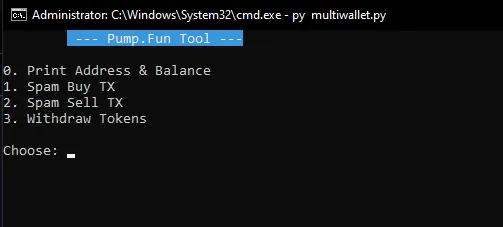

<h1  align="center">pumpfun multi wallets & bundler</h1>

  > Pump.fun multi wallet bot & bundler is the ultimate all-in-one tool you need to dominate in the trenches of Pump.fun.It allows users to utilize multiple wallet configurations optimized for specific functions like the Volume Bot, Bump Bot, Army Snipe Bot, and our flexible Pump.fun Bundler.

  

# Setup Guide 🛠
- Download and extract the source code
- Places your solana private keys into `data/pks.txt`
- Open a cmd window and type `pip install -r requirements.txt`
- Run the bot with `py multiwallet.py`

# Features 🏞
- Create multiple customized wallet sets to perform all kinds of features in the same code, without running different scripts 😵‍💫
- Implementing custom Address Lookup Table (LUT) & complex Jito bundling technique to ensure blazingly fast transactions & efficient savings on fees 💸
- Offers the most intuitive and user-friendly UI/UX in the market, extremely user-friendly!
- The codebase is meticulously optimized to deliver unparalleled stability and speed ⚡
- Seamless integration with <b>*Raydium*</b> buy/sell after token is graduated 🎓

### 📦 Create Token Bundler
- Launch a token with our flexible wallet bundler, bundling from <b>5 to 20</b> wallets 👛
- Choose your desired wallet distribution method:
    - <b>Manual Input Distribution</b>
        - Manually input total bundled wallets and the SOL allocated for each wallet
        - Total SOL, Token Amount, Distribution will be shown on every entry
    - <b>Dynamic Range Distribution (Min/Max)</b>
        - Input total bundled wallets, minimum & maximum SOL range for each wallet
- Bundled wallets are undetected by <b>Bubblemaps</b> on Pump.fun 😈
- Sick of Pump.fun snipers? 🔫 This bundler ensures that snipers can *NEVER* buy ahead of your bundled wallets 🔥
- Custom implementation of Address Look Up Table (LUT) to maximize performance in on-chain operations 🚀

### 🌊 Volume Bot 
- Utilize Sub Wallets to create organic volume for your token 🥬
- Paint an organic influx of buys with:
    - Dynamic Range Distribution of SOL buys (Min/Max)
    - Customizable organic delay between each buys

### 🔥 Bump Bot
- Deploy a token bumper with your Sub Wallets
- Auto rotation of Sub Wallets to consistently bump your token to the main page of Pump.fun to gain traction & visibility
- 
### 👨🏼‍💻 Manage Trades
- Fetch a list of holding tokens for token details
- PnL | Holding | Total Buy | Total Sold | Token Balance | Current Price | Market Cap | Pool
- ⭐ Trade details shows the averages from all the active Sub Wallets of your *Wallet Set*
- 💰 Bundle Sell / Normal Rotation Sell at 100%, 75%, 50%, 25%
- 😇 Additional feature of transferring all tokens from Sub Wallets to Master Wallet for a huge 💩🚽
- 🪢 Seamless integration with <b>*Raydium*</b> buy/sell after token is graduated 🎓
